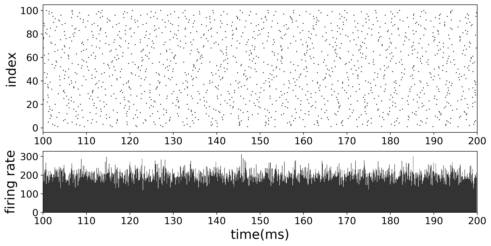

# PMI-Programming-Exercises
The PMI research group sometimes organizes some programming training. Below I have selected some interesting codes and results to upload.

## Deep belief network

Goals: Construct a DBN and train it by contrast divergence algorithm to generate MNIST pictures.

Results: 

1) Training Trajectories

2) Reconstructed results

References:

- Hinton, G. E., Osindero, S., & Teh, Y. W. (2006). A fast learning algorithm for deep belief nets. *Neural computation*, *18*(7), 1527-1554.

## Neural Oscillation

Goals: Construct a spiking neural network and simulate the neural oscillation induced by time delay.

Results:

1) no time delay $\rightarrow$ no neural oscillation

2) with time delay 1.5ms $\rightarrow$ neural oscillation (firing together)

References:

- Brunel, N. (2000). Dynamics of sparsely connected networks of excitatory and inhibitory spiking neurons. *Journal of computational neuroscience*, *8*(3), 183-208.
- Brunel, N. (2000). Phase diagrams of sparsely connected networks of excitatory and inhibitory spiking neurons. *Neurocomputing*, *32*, 307-312.

## Diffusion model

Goals: Build a diffusion model where the backward transform probabilities are trained by MLP;

Results:

1) Forward pass (S curve transforms to Gaussian)

2) Backward pass (Recover S curve from Gaussian noise)

References:

- Sohl-Dickstein, J., Weiss, E., Maheswaranathan, N., & Ganguli, S. (2015, June). Deep unsupervised learning using nonequilibrium thermodynamics. In *International Conference on Machine Learning* (pp. 2256-2265). PMLR.
- Song, J., Meng, C., & Ermon, S. (2020). Denoising diffusion implicit models. *arXiv preprint arXiv:2010.02502*.

